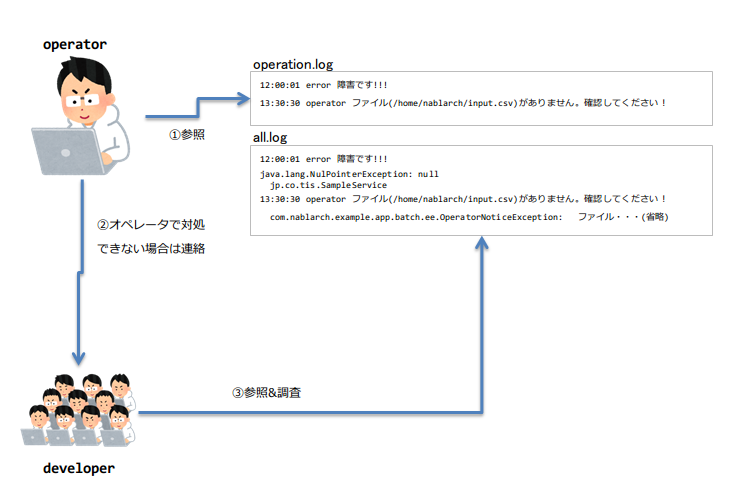

# ログについて

## ログの種類
* all.log  
  全てのログが出力されるログ  
  `operation.log` に対応した詳細情報(スタックトレース)は、このログに出力される。
  
* operation.log  
  障害発生時のメッセージが出力されるログで監視対象となる  
  運用担当者が、この情報を元に障害対応を行う。
  システムエラーの場合には保守担当者に連絡を行う。

* progress.log  
  進捗状況を表すログ。  
  処理遅延時などは、このログを元に現在の処理の終了予測を行い、続行や停止の判断を行う事ができる

## 障害時のログ参照のイメージ

